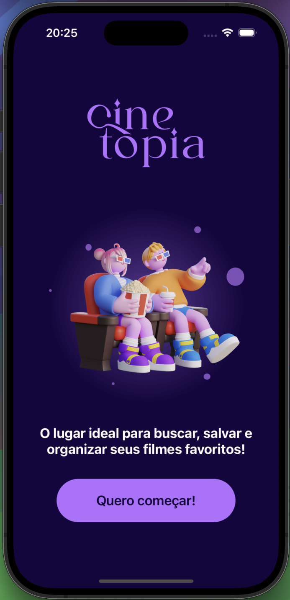
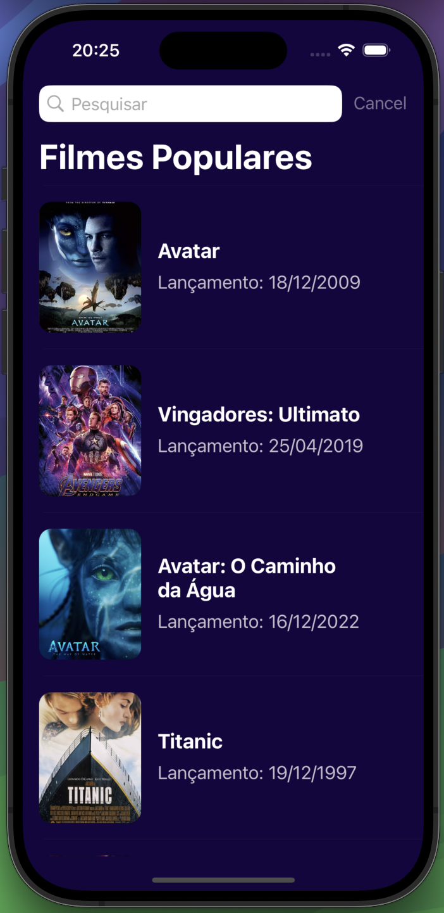
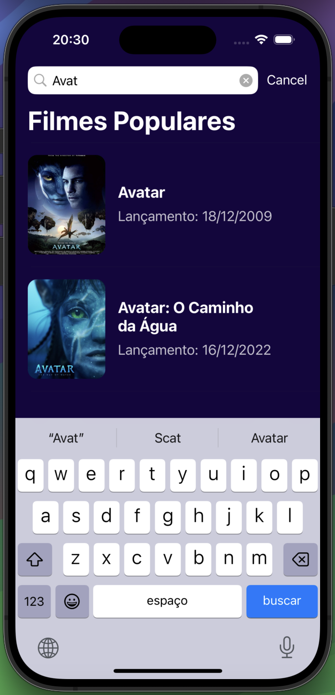

<h1>Cinetopia 🍿</h1>

<h2>📜 Sobre</h2>

Projeto desenvolvido durante a "Formação Desenvolva Aplicativos iOS com View Code" da Alura.

Consiste em um aplicativo para iOS que agrupa uma série de filmes populares e suas principais informações.

  Este projeto serviu para estudar o desenvolvimento de uma série de elementos do UIKit, como Table View, Collection View, Stack View e outros, utilizando a abordagem view code.
  Além disso, foi um meio para praticar requisições a APIs REST, bem como o tratamento das suas respostas e utilização no propósito do projeto.

<h2>✨ Funcionalidades</h2>
<ul>
  <li>Telas com sinopse e avaliação geral dos títulos</li>
  <li>Search bar</li>
</ul>

<h2>💻 Tecnologias</h2>

    
    

<h2>👁️ Preview</h2>

  
  
  
  

<h2>🧑🏻‍💻 Desenvolvido por</h2>

João Faverão
